# Adaptive Layout Practice

A Flutter project demonstrating responsive and adaptive layout techniques for building applications that work beautifully across mobile, tablet, and desktop platforms.

## 📱 Features

- **Responsive Design**: Automatically adapts to different screen sizes
- **Multi-Platform Support**: Works on mobile (iOS/Android), tablet, and desktop
- **Adaptive Layouts**: Different UI layouts for different screen sizes
  - Mobile Layout (< 600px)
  - Tablet Layout (600px - 900px)
  - Desktop Layout (> 900px)
- **Custom Navigation Drawer**: Responsive drawer menu with item models
- **Sliver Widgets**: Efficient scrolling with SliverList and SliverGrid

## 🏗️ Project Structure

```
lib/
├── main.dart                 # App entry point
├── models/
│   └── drawer_item_model.dart    # Data model for drawer items
├── views/
│   └── home_view.dart            # Main home view with scaffold
└── widgets/
    ├── adaptive_layout.dart          # Core adaptive layout widget
    ├── mobile_layout.dart            # Mobile-specific layout
    ├── tablet_layout.dart            # Tablet-specific layout
    ├── desktop_layout.dart           # Desktop-specific layout
    ├── custom_drawer.dart            # Navigation drawer
    ├── custom_drawer_item.dart       # Drawer item widget
    ├── home_view_body.dart           # Home view body
    ├── custom_list.dart              # Custom list widget
    ├── custom_sliver_list_view.dart  # SliverList implementation
    ├── custom_sliver_grid.dart       # SliverGrid implementation
    └── custom_item_1.dart            # Custom item widget 1
    └── custom_item_2.dart            # Custom item widget 2
```

## 📸 Screenshots

The app includes multiple screens showcasing different features across all platforms:

### 📱 Mobile View
<div align="center">
  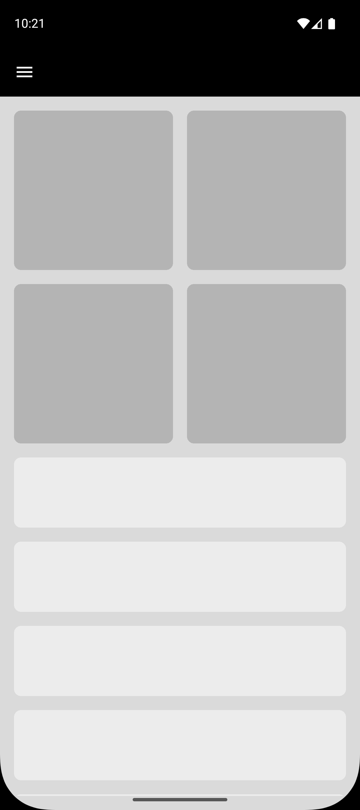
  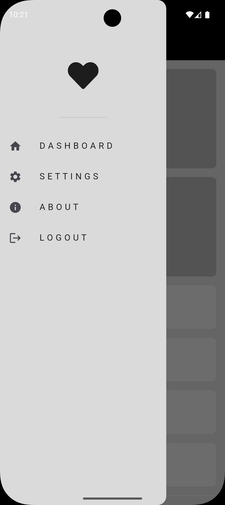
</div>

### 📱 Tablet View

<div align="center">
  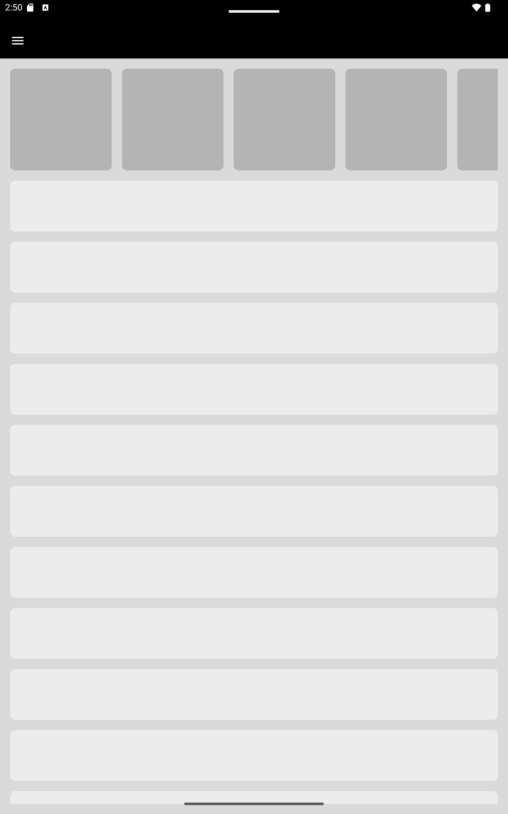
  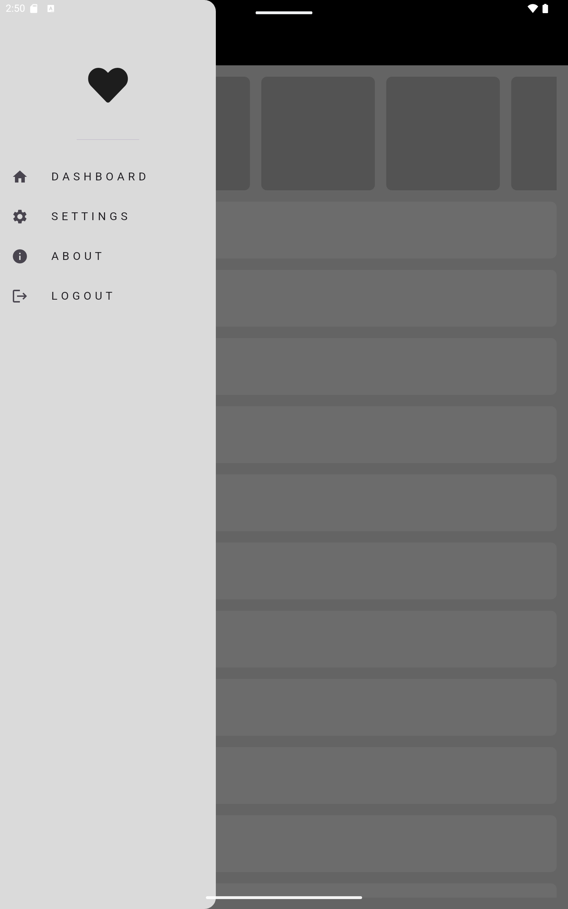
</div>
<div align="center">
  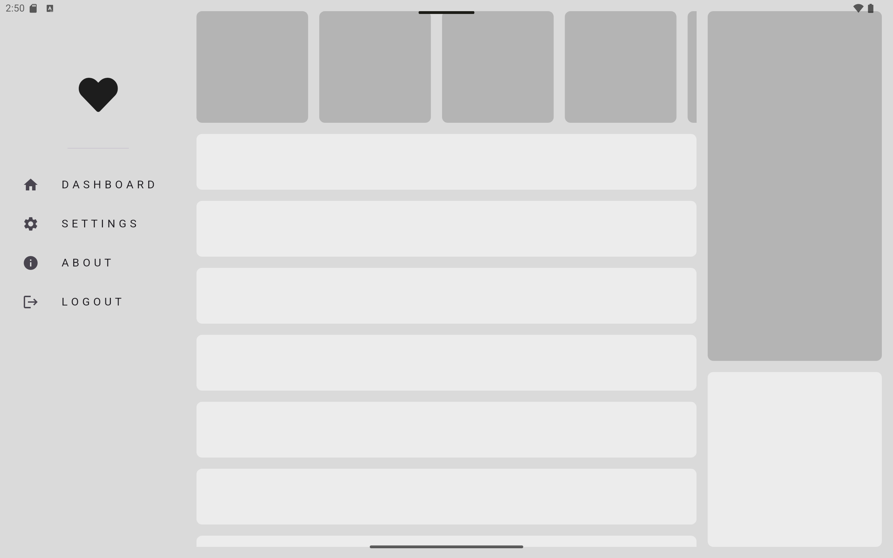
</div>

### 💻 Desktop & Web View
<div align="center">
 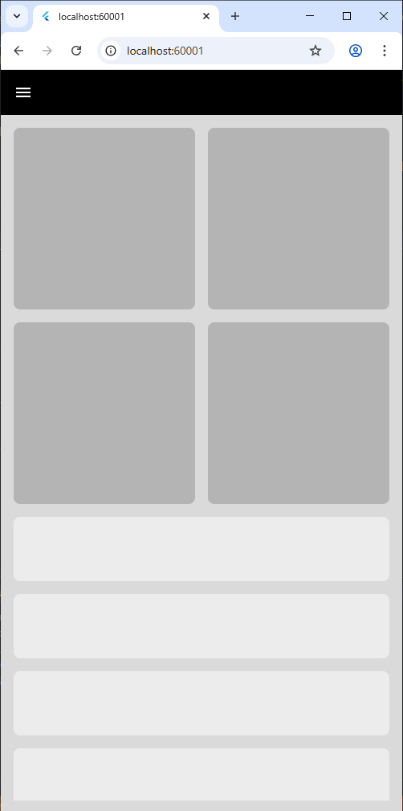
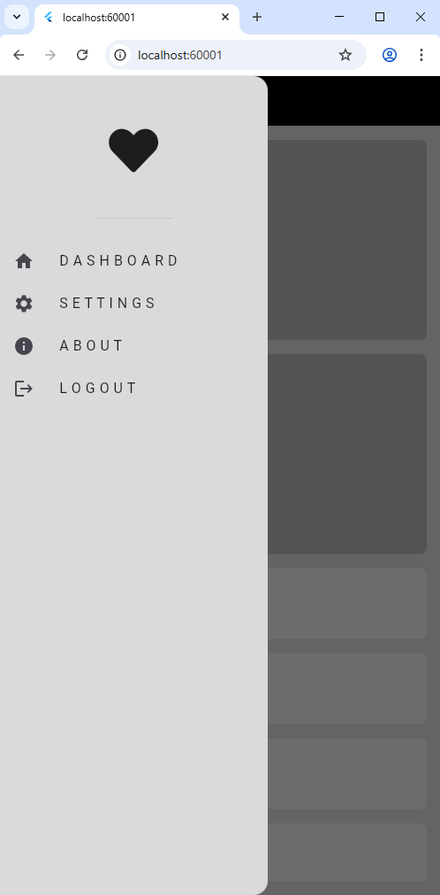
 
</div>
<div align="center">
  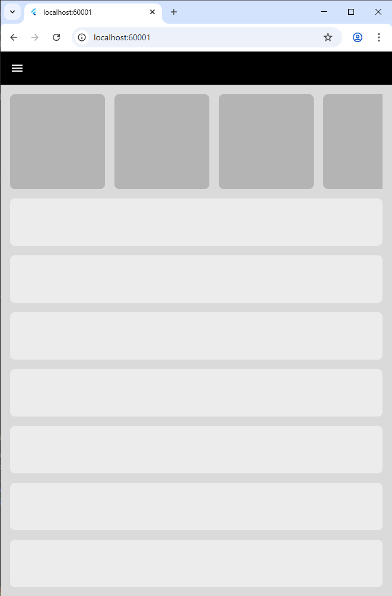
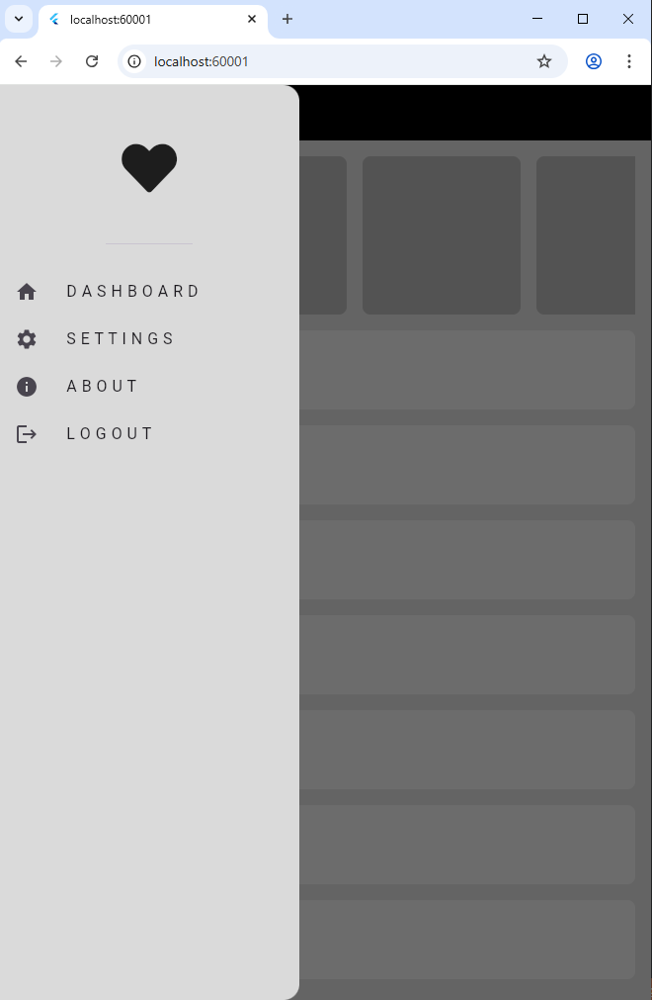
</div>
<div align="center">
  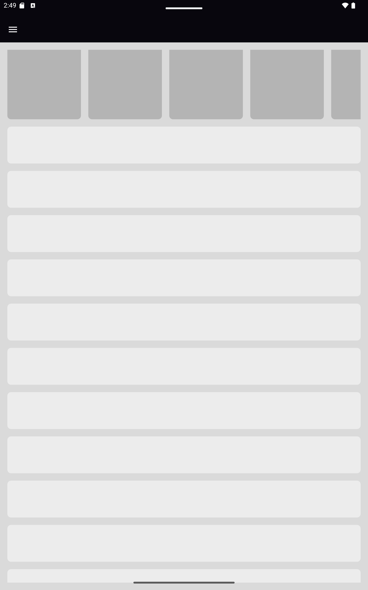
  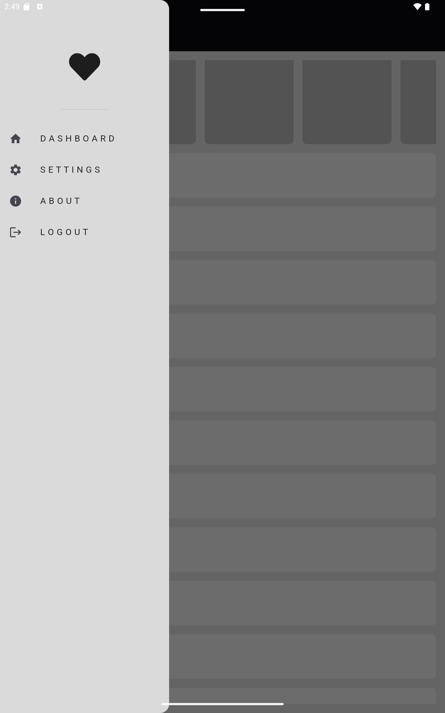
</div>
<div align="center">
  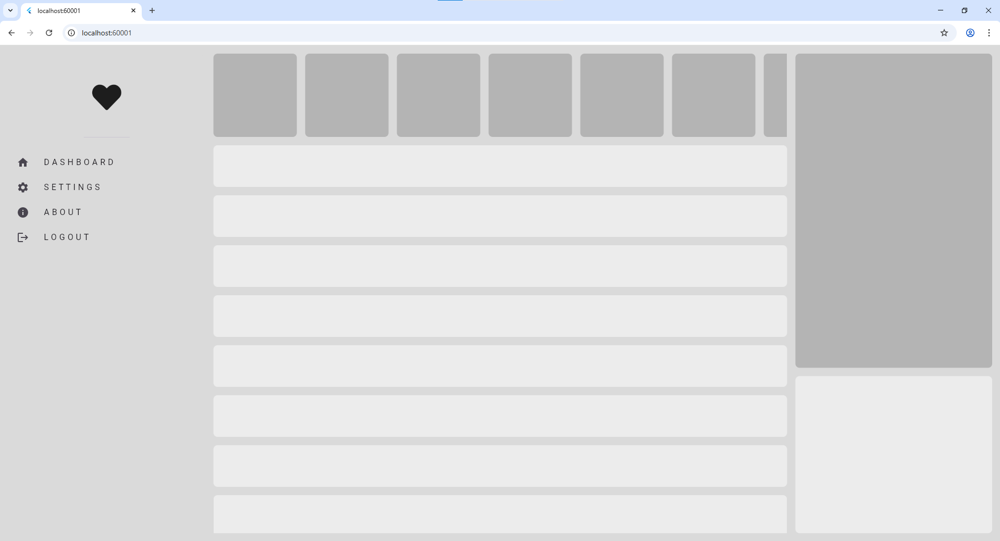

</div>

## 🚀 Getting Started

### Prerequisites

- Flutter SDK (>= 3.5.4)
- Dart SDK (>= 3.5.4)

### Installation

1. Clone the repository
2. Install dependencies:
   ```bash
   flutter pub get
   ```
3. Run the app:
   ```bash
   flutter run
   ```

## 📦 Dependencies

- **flutter**: Flutter SDK
- **cupertino_icons**: ^1.0.8 - iOS style icons
- **font_awesome_flutter**: ^9.2.0 - Font Awesome icons

## 🎨 Adaptive Layout Implementation

The app uses a custom `AdaptiveLayout` widget that leverages `LayoutBuilder` to determine the screen size and return the appropriate layout:

```dart
LayoutBuilder(
  builder: (context, constraints) {
    if (constraints.maxWidth < 600) {
      return mobileLayout(context);    // Mobile
    } else if (constraints.maxWidth < 900) {
      return tabletLayout(context);    // Tablet
    } else {
      return desktopLayout(context);   // Desktop
    }
  },
)
```

## 📚 Learning Resources

This project demonstrates key Flutter concepts:
- LayoutBuilder for responsive design
- MediaQuery for screen size detection
- Sliver widgets for efficient scrolling
- State management with StatefulWidget
- Custom widgets and component reusability
- Navigation patterns for different screen sizes

## 🛠️ Development

### Running on Different Platforms

```bash
# Mobile
flutter run -d chrome
flutter run -d windows
flutter run -d android
flutter run -d ios

# Specify screen size for testing
flutter run -d chrome --web-browser-flag "--window-size=400,800"  # Mobile
flutter run -d chrome --web-browser-flag "--window-size=800,1000" # Tablet
flutter run -d chrome --web-browser-flag "--window-size=1200,800" # Desktop
```

## 📖 Documentation

For help getting started with Flutter development, view the
[online documentation](https://docs.flutter.dev/), which offers tutorials,
samples, guidance on mobile development, and a full API reference.

## 📄 License

This project is open source and available for educational purposes.
